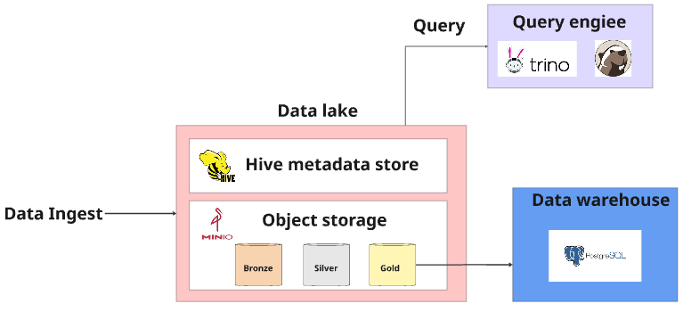
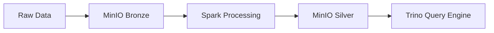

# NYC Taxi Data Lake


A modern data lake solution for analyzing NYC taxi trip data using Trino, MinIO, and Hive Metastore. This system enables efficient querying and analysis of large volumes of taxi trip data through a distributed SQL query engine.



## 🚀 Quick Start

1. Clone the repository
2. Start the infrastructure:
   ```bash
   docker-compose up -d
   ```
3. Access the services:
   - Trino UI: http://localhost:8080
   - MinIO Console: http://localhost:9001
   - Hive Metastore: localhost:9083

## 🏗️ Architecture

### Core Components

| Component | Purpose | Port |
|-----------|---------|------|
| MinIO | Object storage (S3-compatible) | 9000, 9001 |
| Hive Metastore | Metadata repository | 9083 |
| Trino | Distributed SQL query engine | 8080 |
| Apache Spark | ETL processing | - |

### Data Flow



## 🛠️ Infrastructure Setup

### Prerequisites

- Docker and Docker Compose
- 4GB+ RAM
- 20GB+ free disk space

### Docker Compose Configuration

```yaml
version: "3.9"
services:
  trino:
    ports:
      - "8080:8080"
    container_name: datalake-trino
    image: "trinodb/trino:410"
    hostname: trino
    volumes:
      - ./trino/etc:/usr/lib/trino/etc:ro
      - ./trino/catalog:/etc/trino/catalog
    depends_on:
      - hive-metastore

  metastore_db:
    container_name: datalake-metastore-db
    image: postgres:11
    hostname: metastore_db
    ports:
      - '5433:5432'
    environment:
      POSTGRES_USER: hive
      POSTGRES_PASSWORD: hive
      POSTGRES_DB: metastore

  hive-metastore:
    container_name: datalake-hive-metastore
    image: 'starburstdata/hive:3.1.2-e.18'
    hostname: hive-metastore
    ports:
      - '9083:9083'
    environment:
      HIVE_METASTORE_DRIVER: org.postgresql.Driver
      HIVE_METASTORE_JDBC_URL: jdbc:postgresql://metastore_db:5432/metastore
      HIVE_METASTORE_USER: hive
      HIVE_METASTORE_PASSWORD: hive
      S3_ENDPOINT: http://minio:9000
      S3_ACCESS_KEY: minio_access_key
      S3_SECRET_KEY: minio_secret_key
      S3_PATH_STYLE_ACCESS: "true"
    depends_on:
      - metastore_db
      
  minio:
    image: minio/minio
    container_name: datalake-minio
    hostname: minio
    ports:
      - "9000:9000"
      - "9001:9001"
    volumes:
      - minio_storage:/data
    environment:
      MINIO_ACCESS_KEY: minio_access_key
      MINIO_SECRET_KEY: minio_secret_key
    command: server --console-address ":9001" /data
```

## 📝 Configuration

### Trino Catalog Setup

Create `trino/catalog/datalake.properties`:

```properties
connector.name=hive
hive.metastore.uri=thrift://hive-metastore:9083
hive.s3.endpoint=http://minio:9000
hive.s3.aws-access-key=minio_access_key
hive.s3.aws-secret-key=minio_secret_key
hive.s3.path-style-access=true
hive.s3.ssl.enabled=false
hive.allow-drop-table=true
```

First, execute trino container:
```bash
docker exec -ti datalake-trino bash
```
Then run the following command:
```bash
trino
```

## 💾 Data Schema

### Schema Creation

```sql
CREATE SCHEMA IF NOT EXISTS datalake.nyc_taxi 
WITH (location = 's3://bronze/');
```

### Table Definition

```sql
CREATE TABLE IF NOT EXISTS datalake.nyc_taxi.yellow_tripdata (
    VendorID INTEGER,
    tpep_pickup_datetime TIMESTAMP,
    tpep_dropoff_datetime TIMESTAMP,
    passenger_count INTEGER,
    trip_distance DOUBLE,
    RatecodeID INTEGER,
    store_and_fwd_flag VARCHAR,
    PULocationID INTEGER,
    DOLocationID INTEGER,
    payment_type INTEGER,
    fare_amount DOUBLE,
    extra DOUBLE,
    mta_tax DOUBLE,
    tip_amount DOUBLE,
    tolls_amount DOUBLE,
    improvement_surcharge DOUBLE,
    total_amount DOUBLE,
    congestion_surcharge DOUBLE,
    Airport_fee DOUBLE
)
WITH (
    format = 'PARQUET',
    external_location = 's3://bronze/'
);
```

## 🔄 Data Processing

### Data Cleaning with Spark

```python
def clean_data_with_spark(spark_df):
    cleaned_df = spark_df \
        .fillna(1, subset=["passenger_count"]) \
        .fillna(1, subset=["RatecodeID"]) \
        .fillna("N", subset=["store_and_fwd_flag"]) \
        .fillna(0.0, subset=["congestion_surcharge"]) \
        .fillna(0.0, subset=["Airport_fee"])
    
    return cleaned_df
```

## 🔍 Querying Data

Example query to analyze payment types and fares:

```sql
SELECT 
    AVG(trip_distance) AS avg_distance,
    AVG(fare_amount) AS avg_fare,
    payment_type
FROM 
    datalake.nyc_taxi.yellow_tripdata
GROUP BY 
    payment_type
ORDER BY 
    avg_fare DESC;
```


## Running batch processing

First, install dependencies:
```bash
pip install -r requirements.txt
```

Then, run the following command:
```bash
cd src/batch_processing
```

Then, run the following command:
```bash
python upload_data.py
```

Then, run the following command:
```bash
python bronze_to_silver.py
```
if you got bug, please check did you download  aws-java-sdk-bundle-1.11.901.jar and hadoop-aws-3.3.1.jar and check path of these files in Spark Session.

Finally, run the following command:
```bash
python silver_to_gold.py
```

You can go to localhost:9001 to see the data in MinIO Console with user: minio_access_key and password: minio_secret_key
