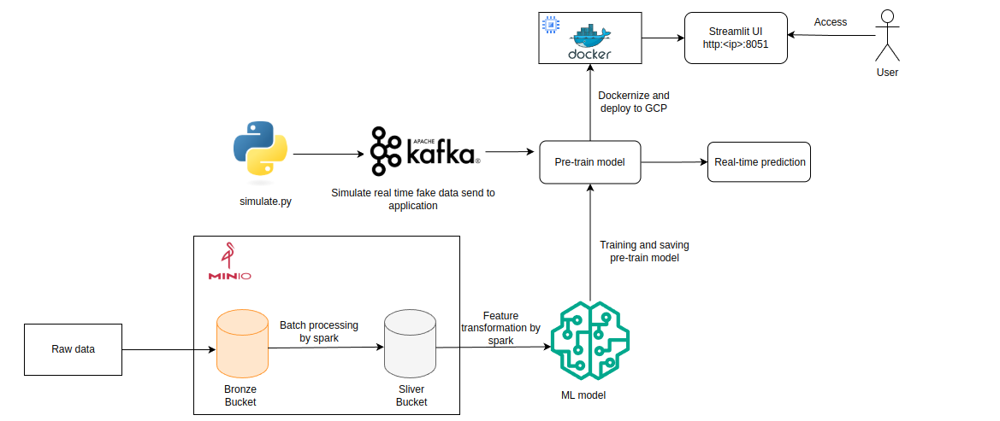
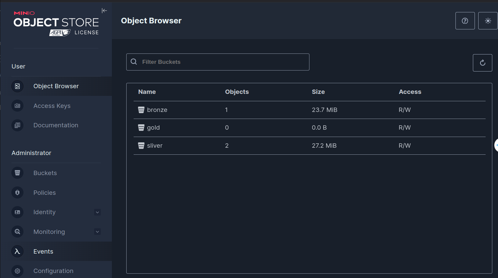
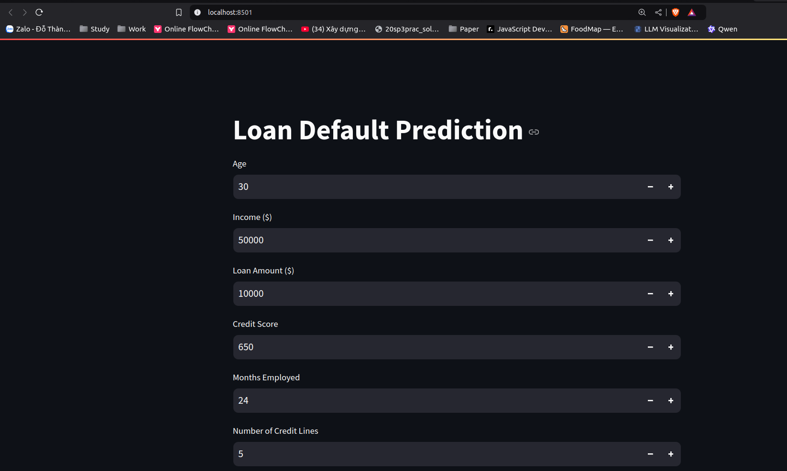

# Scalable-Distributed-Systems

## Project Overview
This project is designed to demonstrate scalable and distributed systems using various technologies such as Kafka, Docker, and machine learning models.

## Directory Structure

Below is the top-level directory structure of the project:

```txt
├── assets          - Directory for storing static assets (e.g., images, CSS, etc.)
├── data            - Directory for storing datasets or raw data
├── Dockerfile      - Dockerfile for containerizing the application
├── .env            - Environment variables file
├── .git            - Git directory for version control
├── .gitignore      - Specifies files and directories to ignore in Git
├── kafka           - Kafka-related configurations and scripts
├── model  - Directory for the loan default model
├── minio           - MinIO-related configurations and scripts
├── README.md       - Project documentation
├──requirements.txt - Python dependencies file
├── src             - Source code directory
└── venv            - Python virtual environment directory
```


## Getting Started

### Prerequisites
- Docker
- Python 3.8+
- Kafka
- MinIO

### Installation
1. Clone the repository:
    ```sh
    git clone https://github.com/Drissdo185/Scalable-Distributed-Systems.git
    cd Scalable-Distributed-Systems
    ```

2. Set up the virtual environment:
    ```sh
    python -m venv venv
    source venv/bin/activate 
    ```

3. Install the required packages:
    ```sh
    pip install -r requirements.txt
    ```

### Running the Project

#### Using Docker
1. Start Kafka:
    ```sh
    docker-compose -f kafka/docker-compose.yaml up
    ```

2. Start MinIO:
    ```sh
    docker-compose -f minio/docker-compose.yml up
    ```
Access the MinIO dashboard at `http://localhost:9001`


#### Running the Python Scripts
1. Run the main script:
    ```sh
    streamlit run src/main.py
    ```
Access the Streamlit dashboard at `http://localhost:8501`


### Containerizing the Application and Deploy to GCP virtual machine

1. Build the Docker image:
    ```sh
    docker build -t scalable-distributed-systems .
    ```
2. Run the Docker container:
    ```sh
    docker run -p 8501:8501 scalable-distributed-systems
    ```
3. Push the Docker image to Docker Hub:
    ```sh
    docker tag scalable-distributed-systems <docker-hub-username>/scalable-distributed-systems
    
    # Push the image
    docker push <docker-hub-username>/scalable-distributed-systems
    ```
4. Create a virtual machine on GCP and SSH into the machine:

5. Pull the Docker image from Docker Hub:
    ```sh
    docker pull <docker-hub-username>/scalable-distributed-systems
    ```

Access the Streamlit dashboard at `http://<external-ip>:8501`

## Streamming processing

After running docker-compose to start Kafka, you can run the following command to start the stream processing:

```sh
cd src/streaming_processing

python simulate.py # simulate the data sending to the kafka topic every 5 seconds

python consumer.py # consume the data and make real-time prediction
```


## Contributing
Please read CONTRIBUTING.md for details on our code of conduct and the process for submitting pull requests.

## License
This project is licensed under the MIT License - see the LICENSE file for details.